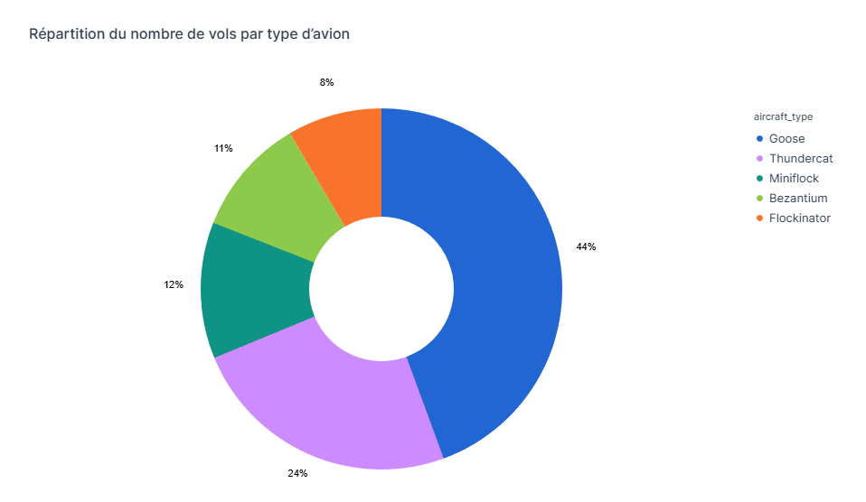
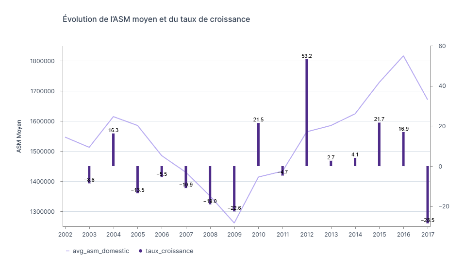

# ✈️ Aircraft Data Analytics: From Cloud Warehouse to Business Insights

## 📌 Présentation du Projet
Ce projet est une analyse exploratoire (EDA) complète du secteur aéronautique. L'objectif est de transformer des données brutes de vols et de métriques de compagnies aériennes en insights stratégiques en utilisant la puissance de la **Modern Data Stack**.

****Objectifs du projet****
- Structurer les données brutes issues de Snowflake
- Construire un modèle analytique via dbt (staging, dimensions, faits)
- Produire des tables exploitables pour l’analyse
- Répondre à des questions métiers à l’aide de SQL
- Restituer les résultats sous forme de visualisations dans Deepnote

****Problématique****
> Comment analyser l’activité aérienne afin d’identifier les avions, aéroports et compagnies les plus performants, ainsi que les dynamiques de croissance au fil du temps ?

****L'analyse se concentre sur trois piliers majeurs :****
1. **Utilisation de la flotte :** Identification des appareils les plus sollicités au quotidien.
2. **Performance financière :** Analyse de la rentabilité par passager (RPM).
3. **Dynamique de croissance :** Corrélation entre la capacité offerte (ASM) et l'expansion réelle des compagnies.

---

## 🛠 Stack Technique & Langages
* **Data Warehouse :** `Snowflake` (Stockage et moteur de calcul).
* **Transformation & Modélisation :** `dbt` (Data Build Tool).
* **Analyse & Notebooks :** `Deepnote` (Cloud) & `VS Code` (Local).
* **Langages :** * `SQL` : Requêtes analytiques et structuration DDL.
    * `Python` : Nettoyage avancé et Visualisation (Pandas, Plotly, Seaborn).
    * `Jinja` : Templating pour rendre les modèles dbt dynamiques et modulaires.

---

## 🏗 Architecture & Modélisation des données

### 1. Pipeline de Transformation dbt
Le projet suit une architecture modulaire pour garantir la robustesse et la qualité de la donnée :
* **Layer Staging :** Nettoyage des données sources, renommage et casting des types.
* **Layer Marts (Modélisation Dimensionnelle) :**
    * **Dimensions (dim) :** Référentiels d'entités (ex: caractéristiques des types d'avions).
    * **Facts (fct) :** Tables de faits centralisant les indicateurs quantitatifs (vols, revenus, croissance).

### 2. Double Approche d'Analyse
* **Workflow Cloud (Deepnote) :** Connexion native à Snowflake pour une restitution visuelle rapide et collaborative.
* **Workflow Local (VS Code) :** Utilisation du connecteur `snowflake-connector-python`.
    * **Stratégie de Fallback :** Le projet inclut un notebook "Offline" utilisant des données locales pour assurer la pérennité de l'analyse même après l'expiration de l'instance Snowflake.

---

## 🧠 Compétences & Techniques Développées

### **Data Engineering & Modélisation**
* **Modélisation en Étoile (Star Schema) :** Organisation des données en tables de faits et de dimensions pour optimiser les performances.
* **Ingénierie de données avec dbt :** Utilisation de **Jinja** (macros, refs) pour un code SQL réutilisable et maintenable.
* **Data Quality :** Gestion rigoureuse des valeurs `NULL` (traitées comme `0` pour les calculs de RPM) afin de ne pas biaiser les résultats.

### **Analytique & Business Intelligence**
* **Calculs de KPI Aéronautiques :** Maîtrise des métriques spécifiques : **ASM** (*Available Seat Miles*) et **RPM** (*Revenue Passenger Kilometer*).
* **Analyse de Croissance :** Calcul des taux de croissance annuels pour identifier les leaders du marché.
* **Data Visualization :** Conception de graphiques décisionnels (Donut charts pour la flotte, Bar charts pour la croissance comparée).

---

## 📈 Insights Clés

* **Utilisation de la flotte** : Le modèle **Goose** domine largement l'activité avec **44% des vols**, confirmant sa place centrale dans les opérations.  

 

&nbsp;

* **Évolution de la capacité (2002-2017)** : L'analyse de l'ASM moyen montre une forte volatilité liée aux cycles économiques. Après une baisse entre 2005 et 2009, la croissance a bondi après 2010 avec un sommet en 2012 **(+53,2%)**.

* **Fragilité du marché** : L'année 2017 marque une chute brutale (**-28,5%**). Cette instabilité montre qu'une forte capacité ne suffit pas à garantir une croissance durable. Pour sécuriser l'activité, les futurs leviers stratégiques devront mieux anticiper les variations de la demande.  

 
---

## 🚀 Installation et Utilisation

### 1. Configuration de Snowflake
1. Connectez-vous à votre interface Snowflake.
2. Créez les objets de base (Database, Schema, Warehouse).
3. Exécutez le script situé dans `data/aircraft_db.sql` pour peupler les données brutes.

### 2. Configuration de dbt
1. Clonez ce dépôt.
2. Configurez votre fichier `profiles.yml` avec vos accès Snowflake.
3. Installez les dépendances et générez les tables :
   ```bash
   dbt deps
   dbt run

### 3. Analyse Python (VS Code)
1. Installez les dépendances nécessaires :
   ```bash
   pip install snowflake-connector-python pandas matplotlib seaborn python-dotenv
2. Mode Online : Utilisez `Analyse_connexion_snowflake.ipynb`. Assurez-vous d'avoir configuré vos variables d'environnement (fichier `.env`) pour la connexion.
3. Mode Offline : Utilisez `Analyse_local_offline.ipynb`. Ce notebook charge les données directement depuis le dossier local pour garantir le fonctionnement du projet sans accès Snowflake.

---

### 🔮 Évolutions Futures
* **Automatisation (CI/CD)** : Mettre en place des tests dbt automatiques (dbt test) pour vérifier l'intégrité des données à chaque run.
* **Predictive Analytics** : Intégrer un modèle de Machine Learning pour prédire les revenus passagers (RPM) selon la saisonnalité.
* **Orchestration** : Utilisation d'un orchestrateur (Airflow ou GitHub Actions) pour automatiser le cycle complet.

---

### 📂 Structure du Répertoire
* `data/` : Contient les scripts SQL bruts (`aircraft_db.sql`) pour l'initialisation de la base de données dans Snowflake. Ainsi que les données sauvegardées en local.
* `dbt_snowflake_aircraft/` : Le cœur de la transformation. Organisé en dossiers `staging` (nettoyage) et `marts` (modélisation dim et fct).
* `Analyse_aircraft_sur_deepnote/` : Regroupe les exports PDF et les visuels générés via l'interface Cloud.
* `Analyse_aircraft_sur_python/` : Le dossier de data science locale comprenant:
  * `Analyse_connexion_snowflake.ipynb` : Le flux en direct.
  * `Analyse_local_offline.ipynb` : La version de secours avec données locales.